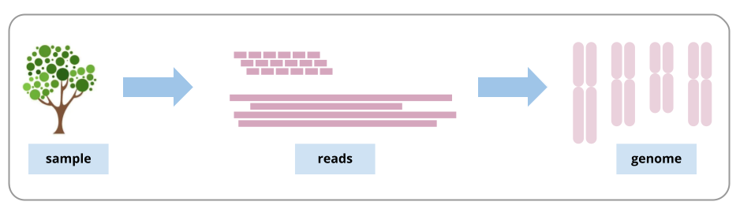
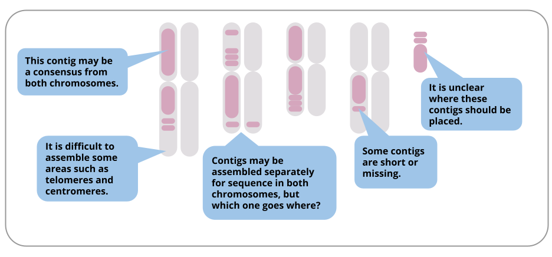
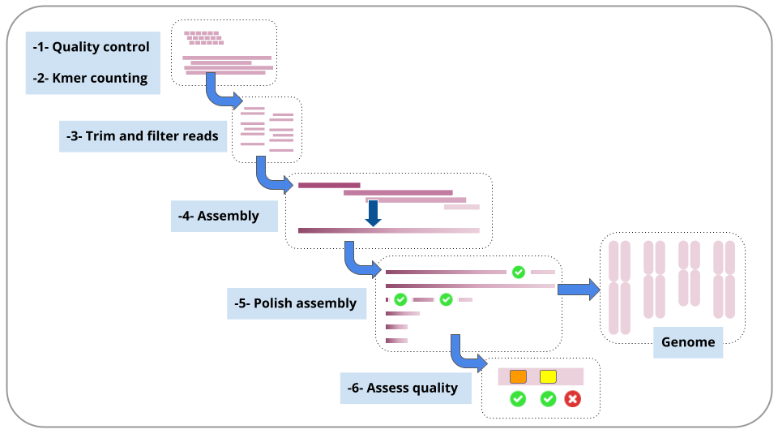
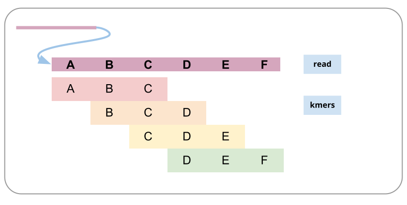
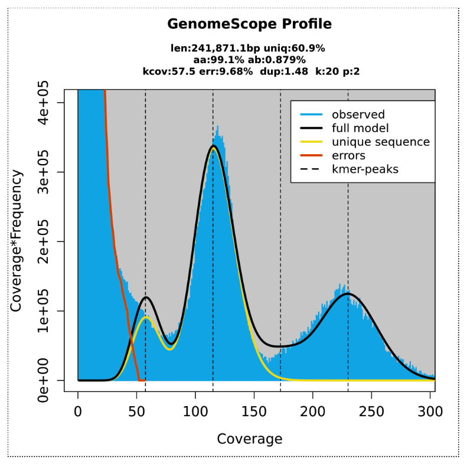
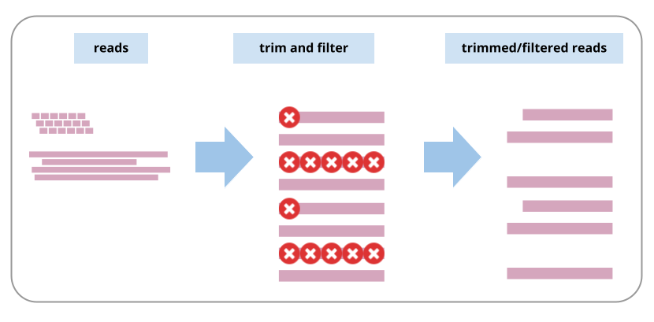

# Introduction
{:.no_toc}

## What is genome assembly?

A genome is a representation of the set of DNA in an organism, such as the set of chromosomes. When the DNA is extracted from the sample, it is broken up into fragments much smaller than the lengths of DNA in the chromosomes. These fragments are called sequencing reads. To assemble the genome, we need to join the reads back into, ideally, chromosome-sized lengths.



*Assembly challenges*

In reality, we rarely get chromosome-length assemblies, due to many challenges. Here are some examples of particular challenges in a diploid genome assembly:



Even though most assemblies are not chromosome-length, the assembly in contigs is still valuable for many research questions. Lengths of assembled contigs are increasing as sequencing technology and assembly tools improve. 

>### Agenda
> In this tutorial we will deal with:
>
> 1. TOC
> {:toc}
>
{: .agenda}


# Analysis workflow

In this tutorial, we will follow these steps: 



* Each of these steps is described in a section in this tutorial. 
* For each step, we will run a workflow. 
* We will stay in the same Galaxy history throughout. 

*How to run a workflow in Galaxy*

* Go to the top panel of Galaxy and see Shared Data -> Workflows. This shows a list of public workflows.
* Find the right workflow for the section you are in.
* Click on the drop-down arrow, and import the workflow. 
* Now this will be in your own list of Workflows. (Galaxy top panel: Workflow) 
* For the workflow you want to run, go to the right hand side and see the arrow button (a triangle), click
* This brings up the workflow in the centre Galaxy panel
* Click "Expand to full workflow form"
* For "Send results to a new history", leave it as "No".
* Each time you run a workflow, you need to specify the input data set (or sets). Galaxy will try to guess which file this is, but change if required using the drop-down arrow. 
* At the top right, click "Run Workflow". 
* The result files will appear at the top of your current history

Each workflow will be discussed in a separate section.

# Upload data

Let's start with uploading the data.

*What sequence data are we using in the tutorial?*

* The data sets for genome projects can be very large and tools can take some time to run. It is a good idea to test that your planned tools and workflows will work on smaller-sized test data sets, as it is much quicker to find out about any problems. 
* In this tutorial we will use a subset of real sequencing data from a plant genome, the snow gum, Eucalyptus pauciflora, from a genome project described in this paper: Wang W, Das A, Kainer D, Schalamun M, Morales-Suarez A, Schwessinger B, Lanfear R; 2020, doi: 10.1093/gigascience/giz160.  Data is hosted at NCBI BioProject number: PRJNA450887.

*How has this data subset been prepared?*

* From NCBI, three read files were imported into Galaxy for this tutorial: nanopore reads (SRR7153076), and paired Illumina reads (SRR7153045). 
* These were randomly subsampled to 10% of the original file size. 
* Plant genomes may contain an excess of reads from the chloroplast genome (of which there are many copies per cell). To ensure our test data sets are not swamped from excessive chloroplast-genome reads, reads that mapped to a set of known chloroplast gene sequences were discarded.
* These steps are described in more detail, with a workflow, in the tutorial section How to prepare a test-sized set of data.

We are also using a reference genome  Arabidopsis thaliana for a later comparison step (file TAIR10_chr_all.fas downloaded from https://www.arabidopsis.org/download/index-auto.jsp?dir=%2Fdownload_files%2FGenes%2FTAIR10_genome_release%2FTAIR10_chromosome_files )

> ###  Hands-on: Import the data
> 1. Create a new history for this tutorial and give it a proper name
>
>    
>    
>
> 2. Import from [Zenodo](https://zenodo.org/record/7055935) or a data library (ask your instructor):
>   - 2 FASTQ files with illumina reads: these files have a R1 or R2 in the name
>   - 1 FASTQ file with nanopore reads: this file has nano in the name
>   - 1 FASTQ file for the genome Arabidopsis
>   
>    ```
>    https://zenodo.org/record/7055935/files/Eucalyptus_subsample_ten_pc_SRR7153045_R1.fastq.gz
>    https://zenodo.org/record/7055935/files/Eucalyptus_subsample_ten_pc_SRR7153045_R2.fastq.gz
>    https://zenodo.org/record/7055935/files/Eucalyptus_subsample_ten_pc_nano_SRR7153076.fastq.gz
>    https://zenodo.org/record/7055935/files/Ref_genome_Arabidopsis.fasta
>    ```
>
>    
>    
{: .hands_on}

* This tutorial uses these input files and gives some examples from the results.
* It is likely that your results will differ slightly (e.g. number of bases in the genome assembly). This is common, because many tools start from different random seeds. 
* Also, tool versions are being constantly updated.  Newer versions may be available since this tutorial was written and could give slightly different results. 

# Check read quality

Let's look at how many reads we have and their quality scores using the Data QC workflow. 

* Workflow link: https://usegalaxy.org.au/u/anna/w/data-qc 
* What it does: Reports statistics from sequencing reads
* Inputs: long reads (fastq.gz format); short reads (R1 and R2) (fastq.gz format)
* Outputs: For long reads: a nanoplot report (the HTML report summarizes all the information). For short reads: a MultiQC report 
* Tools used: Nanoplot, FastQC, MultiQC
* Input parameters: None required
* Workflow steps: Long reads are analysed by Nanoplot. Short reads (R1 and R2) are analysed by FastQC; the resulting reports are processed by MultiQC
* Options: See the tool settings options at runtime and change as required. Alternative tool option: fastp

*Run workflow*

From your current Galaxy history (which contains the test data for this tutorial): go to the top panel in Galaxy, click Shared Data: Workflows, find this workflow, enter the correct input files, and run.

*Data QC results*

What are the results from the two output files? Are the reads long enough and of high enough quality for our downstream analyses? Will reads need any trimming or filtering? Common things to check are average read length, average quality, and whether quality varies by position in the reads. 
* Look at the plot fro MultiQC for the Sequence Quality Histograms. This shows how the read quality of Illumina reads (y axis) varies according to base position (x axis).You may see for Illumina reads that there is some drop-off in quality towards the end of the reads, which may benefit from trimming. 
* Look at the plot from Nanoplot for "Read lengths vs Average read quality". The nanopore reads have a mean read quality of 9.0. Depending on the size of our input read sets and the research question, we may filter out reads below a certain average quality. If we had a lot of reads, we may be able to set a higher threshold for filtering according to read quality. 

More about interpreting nanoplot plots: 
https://github.com/wdecoster/NanoPlot
https://gigabaseorgigabyte.wordpress.com/2017/06/01/example-gallery-of-nanoplot/

More about FastQC results: https://www.bioinformatics.babraham.ac.uk/projects/fastqc/
https://timkahlke.github.io/LongRead_tutorials/QC_F.html

# Determine genome characteristics

To prepare for genome assembly you might want to know things about your genome such as size, ploidy level (how many sets of chromosomes) and heterozygosity (how variable the sequence is between homologous chromosomes). A relatively fast way to estimate these things is to count small fragments of the sequencing reads (called kmers).

A read broken into kmers:



*What is kmer counting?*

Kmer counting is usually done with high-accuracy short reads, not long reads which may have high error rates.  After counting how many times each kmer is seen in the reads, we can see what sorts of counts are common. For example, lots of kmers may have been found 24 or 25 times. A graph shows the number of different kmers (y axis) found at different counts, or depths (x axis). 

Many different kmers will be found the same number of times; e.g. X25. If kmer length approaches read length, this means the average depth of your sequencing is also ~X25, and there would be a peak in the graph at this position (smaller kmers = higher kmer depth). There may be smaller peaks of kmer counts at higher depths, e.g. X50 or X100, indicating repeats in the genome. There may be other smaller peaks of kmers found at half the average depth, indicating a diploid genome with a certain amount of difference between the homologous chromosomes - this is known as heterozygosity. Thus, the plot of how many different kmers are found at all the depths will help inform estimates of sequencing depth, ploidy level, heterozygosity, and genome size. 


* Workflow name: Kmer counting - meryl
* Workflow link: https://usegalaxy.org.au/u/anna/w/kmer-counting-meryl
* What it does: Estimates genome size and heterozygosity based on counts of kmers
* Inputs: One set of short reads: e.g. R1.fq.gz
* Outputs: GenomeScope graphs
* Tools used: Meryl, GenomeScope
* Input parameters: None required
* Workflow steps The tool meryl counts kmers in the input reads (k=21), then converts this into a histogram. GenomeScope: runs a model on the histogram; reports estimates. k-mer size set to 21. 
* Options: Use a different kmer counting tool. e.g. khmer. If so, for the settings, advanced parameters: k-mer size: 21 (as per this recommendation https://github.com/schatzlab/genomescope/issues/32). n_tables: 4. tablesize: set at 8 billion (as per this recommendation https://khmer.readthedocs.io/en/v1.0/choosing-table-sizes.html). Will also need to run some formatting steps to convert khmer output to a two-column matrix, for the  Genomscope. See this workflow: https://usegalaxy.org.au/u/anna/w/kmer-counting-khmer. Note: khmer: to use both R1 and R2 read sets, khmer needs these paired reads in interleaved format. 

*Run workflow*
From your current Galaxy history, run this workflow with the required input data.

*Kmer counting results*

GenomeScope transformed linear plot:



Here we can see a central peak - showing that most of the different kmers were found at counts of ~ 120. These are kmers from single-copy homozygous alleles. To the left, a smaller peak at around half the coverage, showing kmers from heterozygous alleles (note that this peak gets higher than the main peak when heterozygosity is only ~ 1.2%). To the right, another smaller peak showing kmers at higher coverage, from repeat regions. Information from these three peaks provide a haploid genome length estimate of ~240,000 bp (note this is test data so smaller than whole plant genome size). 

The output Summary file shows more detail: 
* Genome unique length: from single copy homozygous and heterozygous alleles (under the main and left peak).
* Genome repeat length: from repeat copies (under the graph to the right of the main peak).
* Genome haploid length: unique length + repeat length


More about kmer counting: See https://bioinformatics.uconn.edu/genome-size-estimation-tutorial/#

Meryl: See "Rhie, A., Walenz, B.P., Koren, S. et al. Merqury: reference-free quality, completeness, and phasing assessment for genome assemblies" https://genomebiology.biomedcentral.com/articles/10.1186/s13059-020-02134-9

Genomescope: See "Vurture, G et al.GenomeScope: fast reference-free genome profiling from short reads" https://doi.org/10.1093/bioinformatics/btx153 (Note: the supplementary information is very informative). 


# Trim and filter reads

Using information from Data QC and kmer counting, we may want to trim and/or filter reads. The settings for trimming and filtering depend on many things, including: 
* your aim (accuracy; contiguity)
* your data: type, error rate, read depth, lengths, quality (average, variation by position)
* the ploidy and heterozygosity of your sample
* choice of assembly tool (e.g. it may automatically deal with adapters, low qualities, etc.)


Because of all these factors, few specific recommendations are made here, but the workflow is provided and can be customised. If you are unsure how to start, use your test data to try different settings and see the effect on the resulting size and quality of the reads, and the downstream assembly contigs. Newer assemblers are often configured to work well with long-read data and in some cases, read trimming/filtering for long reads may be unnecessary. 

Trimming and filtering reads:



*Run the workflow*


* Workflow name: Trim and filter reads  
* Workflow link
https://usegalaxy.org.au/u/anna/w/trim-and-filter-reads-fastp 
* What it does: Trims and filters raw sequence reads according to specified settings. 
* Inputs: Long reads (format fastq), Short reads R1 and R2 (format fastq) 
* Outputs: Trimmed and filtered reads: fastp_filtered_long_reads.fastq.gz (But note: no trimming or filtering is on by default), fastp_filtered_R1.fastq.gz, fastp_filtered_R2.fastq.gz
* Tools used:  fastp (Note. The latest version (0.20.1) of fastp has an issue displaying plot results. Using version 0.19.5 here instead until this is rectified). 
* Input parameters: None required, but recommend removing the long reads from the workflow if not using any trimming/filtering settings. 
* Workflow steps: 
** Long reads: fastp settings: These settings have been changed from the defaults (so that all filtering and trimming settings are now disabled). Adapter trimming options: Disable adapter trimming: yes. Filter options: Quality filtering options: Disable quality filtering: yes. Filter options: Length filtering options: Disable length filtering: yes. Read modification options: PolyG tail trimming: Disable. Output options: output JSON report: yes
** Short reads: fastp settings:adapter trimming (default setting: adapters are auto-detected), quality filtering (default: phred quality 15), unqualified bases limit (default = 40%), number of Ns allowed in a read (default = 5), length filtering (default length = min 15)
polyG tail trimming (default = on for NextSeq/NovaSeq data which is auto detected), Output options: output JSON report: yes

* Options: 
** Change any settings in fastp for any of the input reads. Adapter trimming: input the actual adapter sequences. (Alternative tool for long read adapter trimming: Porechop.) Trimming n bases from ends of reads if quality less than value x  (Alternative tool for trimming long reads: NanoFilt.) Discard post-trimmed reads if length is < x (e.g. for long reads, 1000 bp)
Example filtering/trimming that you might do on long reads: remove adapters (can also be done with Porechop), trim bases from ends of the reads with low quality (can also be done with NanoFilt), after this can keep only reads of length x (e.g. 1000 bp) 
If not running any trimming/filtering on nanopore reads, could delete this step from the workflow entirely.


# Assemble reads

We will assemble the long nanopore reads.

> ###  Hands-on: Assemble reads
> 1. :
>    - *"Input reads"*: `sweet-potato-chloroplast-nanopore-reduced.fastq`
>    - *"Estimated genome size"*: `160000`
>    - *Leave other settings as default*
>
> 2. Re-name the `consensus` output file to `flye-assembly.fasta`
>
>    
>
> 3. **View output**:
>    * There are five output files.
>    * *Note: this tool is heuristic; your results may differ slightly from the results here, and if repeated.*
>    * View the `log` file and scroll to the end to see how many contigs (fragments) were assembled and the length of the assembly.
>    * View the `assembly_info` file to see contig names and lengths.
{: .hands_on}


> ###  Hands-on: View the assembly
> 1. 
>    - *"Graphical Fragment Assembly"*: the Flye output file `Graphical Fragment Assembly` (not the "assembly_graph" file)
>    - *Leave other settings as default*
> 2. 
>    - *"Graphical Fragment Assembly"*: the Flye output file `Graphical Fragment Assembly` (not the "assembly_graph" file)
>    - *"Node length labels"*: `Yes`
>    - *Leave other settings as default*
{: .hands_on}

Your assembly graph may look like this:


*Note: a newer version of the Flye assembly tool now resolves this assembly into a single circle.*

> ###  Question
> What is your interpretation of this assembly graph?
> > ###  Solution
> > One interpretation is that this represents the typical circular chloroplast structure: There is a long single-copy region (the node of around 78,000 bp), connected to the inverted repeat (a node of around 28,000 bp), connected to the short single-copy region (of around 11,000 bp). In the graph, each end loop is a single-copy region (either long or short) and the centre bar is the collapsed inverted repeat which should have about twice the sequencing depth.
> {: .solution}
{: .question}

> ###  Further Learning
> * Repeat the Flye assembly with different parameters, and/or a filtered read set.
> * You can also try repeating the Flye assembly with an earlier version of the tool, to see the difference it makes. In the tool panel for Flye, click on the 'Versions' button at the top to change.
> * Try an alternative assembly tool, such as Canu or Unicycler.
{: .comment}

# Polish assembly

Short illumina reads are more accurate the nanopore reads. We will use them to correct errors in the nanopore assembly.

First, we will map the short reads to the assembly and create an alignment file.

> ###  Hands-on: Map reads
> 1. :
>    - *"Will you select a reference genome from your history"*: `Use a genome from history`
>    - *"Use the following dataset as the reference sequence"*: `flye-assembly.fasta`
>    - *"Algorithm for constructing the BWT index"*: `Auto. Let BWA decide`
>    - *"Single or Paired-end reads"*: `Single`
>    - *"Select fastq dataset"*: `sweet-potato-illumina-reduced.fastq`
>    - *"Set read groups information?"*: `Do not set`
>    - *"Select analysis mode"*: `Simple Illumina mode`
>2. **Re-name output file**:
>   - Re-name this file `illumina.bam`
{: .hands_on}

Next, we will compare the short reads to the assembly, and create a polished (corrected) assembly file.

> ###  Hands-on: Polish
> 1. :
>    - *"Source for reference genome used for BAM alignments"*: `Use a genome from history`
>    - *"Select a reference genome"*: `flye-assembly.fasta`
>    - *"Type automatically determined by pilon"*: `Yes`
>    - *"Input BAM file"*: `illumina.bam`
>    - *"Variant calling mode"*: `No`
>    - *"Create changes file"*: `Yes`
>
> 2. **View output**:
>   * What is in the `changes` file?
>   * Rename the fasta output to `polished-assembly.fasta`
>
>    
>
> 3. 
>    - Find and run the tool called "Fasta statistics" on both the original flye assembly and the polished version.
{: .hands_on}

> ###  Question
> How does the polished assembly compare to the unpolished assembly?
> > ###  Solution
> > This will depend on the settings, but as an example: your polished assembly might be about 10-15 Kbp longer. Nanopore reads can have homopolymer deletions - a run of AAAA may be interpreted as AAA - so the more accurate illumina reads may correct these parts of the long-read assembly. In the changes file, there may be a lot of cases showing a supposed deletion (represented by a dot) being corrected to a base.
> {: .solution}
{: .question}

*Optional further steps:*
* Run a second round (or more) of Pilon polishing. Keep track of file naming; you will need to generate a new bam file first before each round of Pilon.
* Run an alternative polishing tool, such as Racon. This uses the long reads themselves to correct the long-read (Flye) assembly. It would be better to run this tool on the Flye assembly before running Pilon, rather than after Pilon.

# Annotate the assembly

We can now annotate our assembled genome with information about genomic features.

* A chloroplast genome annotation tool is not yet available in Galaxy; for an approximation, here we can use the tool for bacterial genome annotation, Prokka.

> ###  Hands-on: Annotate with Prokka
>
> 1.  with the following parameters (leave everything else unchanged)
>    -  *"contigs to annotate"*: `polished-assembly.fasta`
> 2. **View output**:
>    * The GFF and GBK files contain all of the information about the features annotated (in different formats.)
>    * The .txt file contains a summary of the number of features annotated.
>    * The .faa file contains the protein sequences of the genes annotated.
>    * The .ffn file contains the nucleotide sequences of the genes annotated.
{: .hands_on}


Alternatively, you might want to use a web-based tool designed for chloroplast genomes.

* One option is the GeSeq tool, described here. Skip this step if you have already used Prokka above.

> ###  Hands-on: Annotate with GeSeq
> * Download `polished-assembly.fasta` to your computer (click on the file in your history; then click on the disk icon).
> * In a new browser tab, go to [Chlorobox](https://chlorobox.mpimp-golm.mpg.de/geseq.html) where we will use the GeSeq tool () to annotate our sequence.
> * Upload the `fasta` file there. Information about how to use the tool is available on the page.
> * Once the annotation is completed, download the required files.
> * In Galaxy, import the annotation `GFF3` file.
{: .hands_on}

Now make a JBrowse file to view the annotations (the GFF3 file - produced from either Prokka or GeSeq) under the assembly (the polished-assembly.fasta file).

> ###  Hands-on: View annotations
> 1. :
>    - *"Reference genome to display"*: `Use a genome from history`
>        - *"Select a reference genome"*: `polished-assembly.fasta`
>    - *"Produce Standalone Instance"*: `Yes`
>    - *"Genetic Code"*: `11. The Bacterial, Archaeal and Plant Plastid Code`
>    - *"JBrowse-in-Galaxy Action"*: `New JBrowse instance`
>    - *"Insert Track Group"*
>        - *"Insert Annotation Track"*
>            - *"Track Type"*: `GFF/GFF3/BED Features`
>            - *"GFF/GFF3/BED Track Data"*: the `GFF3` file
>            - *Leave the other track features as default*
> 2. **Re-name output file**:
>    - JBrowse may take a few minutes to run. There is one output file: re-name it `view-annotations`
> 3. **View output**:
>    * Click on the eye icon to view the annotations file.
>    * Select the right contig to view, in the drop down box.
>    * Zoom out (with the minus button) until annotations are visible.
{: .hands_on}

Here is an embedded snippet showing JBrowse and the annotations:



# View reads

We will look at the original sequencing reads mapped to the genome assembly. In this tutorial, we will import very cut-down read sets so that they are easier to view.

> ###  Hands-on: Import cut-down read sets
> 1.  from [Zenodo](https://zenodo.org/record/3567224) or a data library (ask your instructor):
>   - FASTQ file with illumina reads: `sweet-potato-chloroplast-illumina-tiny.fastq`
>   - FASTQ file with nanopore reads: `sweet-potato-chloroplast-nanopore-tiny.fastq`
>   - Note: these are the "tiny" files, not the "reduced" files we imported earlier.
>    ```
>    https://zenodo.org/record/3567224/files/sweet-potato-chloroplast-illumina-tiny.fastq
>    https://zenodo.org/record/3567224/files/sweet-potato-chloroplast-nanopore-tiny.fastq
>    ```
{: .hands_on}

> ###  Hands-on: Map the reads to the assembly
> * Map the Illumina reads (the new "tiny" dataset) to the `polished-assembly.fasta`, the same way we did before, using bwa mem.
> * This creates one output file: re-name it `illumina-tiny.bam`
> * Map the Nanopore reads (the new "tiny" dataset) to the `polished-assembly.fasta`. The settings will be the same, except `Select analysis mode` should be `Nanopore`
> * This creates one output file: re-name it `nanopore-tiny.bam`
{: .hands_on}

> ###  Hands-on: Visualise mapped reads
> 1. :
>    - *"Reference genome to display"*: `Use a genome from history`
>        - *"Select a reference genome"*: `polished-assembly.fasta`
>    - *"Produce Standalone Instance"*: `Yes`
>    - *"Genetic Code"*: `11. The Bacterial, Archaeal and Plant Plastid Code`
>    - *"JBrowse-in-Galaxy Action"*: `New JBrowse instance`
>    - *"Insert Track Group"*
>        - *"Insert Annotation Track"*
>            - *"Track Type"*: `BAM pileups`
>            - *"BAM track data"*: `nanopore-tiny.bam`
>            - *"Autogenerate SNP track"*: `No`
>            - *Leave the other track features as default*
>        - *"Insert Annotation Track"*.
>            - *"Track Type"*: `BAM pileups`
>            - *"BAM track data"*: `illumina-tiny.bam`
>            - *"Autogenerate SNP track"*: `No`
>            - *Leave the other track features as default*
> 2. **Re-name output file**:
>    - JBrowse may take a few minutes to run. There is one output file: re-name it `assembly-and-reads`
> 3. **View output**:
>    * Click on the eye icon to view. (For more room, collapse Galaxy side menus with corner < > signs).
>    *  Make sure the bam files are ticked in the left hand panel.
>    * Choose a contig in the drop down menu. Zoom in and out with + and - buttons.
{: .hands_on}

Here is an embedded snippet showing JBrowse and the mapped reads:




> ###  Questions
>
> 1. What are the differences between the nanopore and the illumina reads?
> 2. What are some reasons that the read coverage may vary across the reference genome?
>
> > ###  Solutions
> > 1. Nanopore reads are longer and have a higher error rate.
> > 2. There may be lots of reasons for varying read coverage. Some possibilities: In areas of high read coverage: this region may be a collapsed repeat. In areas of low or no coverage: this region may be difficult to sequence; or, this region may be a misassembly.
> {: .solution}
{: .question}

* To learn more about JBrowse and its features, see the [Genomic Data Visualisation with JBrowse tutorial]({{site.baseurl}}/topics/visualisation/tutorials/jbrowse/tutorial.html)


# Repeat with new data

*Optional extension exercise*

We can assemble another chloroplast genome using sequence data from a different plant species: the snow gum, *Eucalyptus pauciflora*. This data is from . It is a subset of the original FASTQ read files (Illumina - SRR7153063, Nanopore - SRR7153095).

> ###  Hands-on: Assembly and annotation
> * Get data: at this [Zenodo link](https://doi.org/10.5281/zenodo.3600662), then upload to Galaxy.
> * Check reads: Run Nanoplot on the nanopore reads.
> * Assemble: Use Flye to assemble the nanopore reads, then get Fasta statistics *Note: this may take several hours.*
> * Polish assembly: Use Pilon to polish the assembly with short Illumina reads. *Note: Don't forget to map these Illumina reads to the assembly first using bwa-mem, then use the resulting `bam` file as input to Pilon.*
> * Annotate: Use the GeSeq tool at [Chlorobox](https://chlorobox.mpimp-golm.mpg.de/geseq.html) or the Prokka tool within Galaxy.
> * View annotations:Use JBrowse to view the assembled, annotated genome.
{: .hands_on}

# Conclusion
{:.no_toc}
